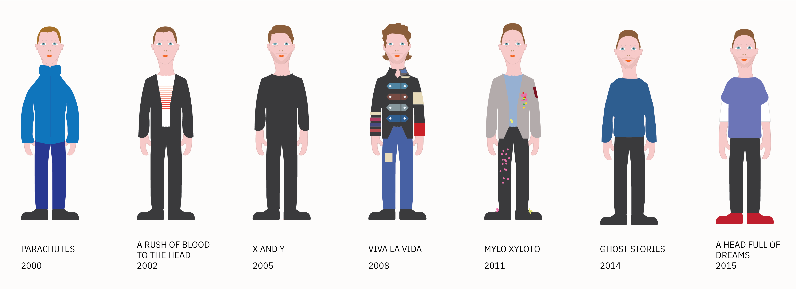

### Coldplay

Uses Watson Personality Insights to analyze the lyrical changes of the the band Coldplay. Experiments with CSS Houdini for visualizing the data.



#### Getting Started

This project plays with the CSS Houdini Paint API you can read more about it [here](https://developer.mozilla.org/en-US/docs/Web/Houdini).

The CSS Houdini specifications are only beginning to be adopted by web browsers. I tested my work with the latest versions of Chrome ( version 77 as I write this ).

#### Prerequisites

This project uses [Node JS](https://nodejs.org/en/download/) as a run time environment.

#### Installing

Assuming you have Node JS installed. Clone this repo, and cd into the folder you've cloned. You should see a file there called app.js

type:

```
npm install
```

when the node dependencies have installed

```
node app
```

You should see some output like this:

```
server starting on http://localhost:3000
```

#### Running

#### Overview
